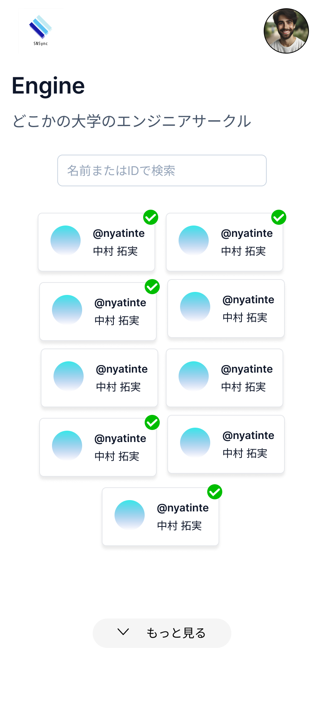

# 要件定義

## As-Is

複数人でのSNSの共有が地味に面倒くさい。例: 飲み会、カンファレンス、勉強会

各自QRコードを作成し、お互い見せ合ってというフローを複数人で行うと、誰をフォローしたかわからなくなる。

## To-Be

複数人でのSNSの共有を楽にする。
具体的には、複数人でのグループを作成し、そのグループに所属する人のSNSをフォローできるようにする。

## 画面イメージ

- グループ画面

## 機能

まずはX(Twitter)に絞る。XのAPIはスケールした場合に高額になるのに加え、フォローに関するAPIが2024/02/06時点で確認できないので不要。

- グループ
  - グループを作成
    - 全てのユーザーが作成できる
  - グループに参加できる
    - URL、もしくはIDとパスワード（任意）が必要
  - グループ退会
    - 任意のタイミングで退会できる
- フォロー
  - ユーザーをクリックしてXに遷移
  - クリックしたあとはユーザーにチェックマークが表示される
- 認証
  - UXのために外し、自己管理型のグループとする
  

## 求められる技術

ここからWeb開発に参加するメンバーもいるので、市場シェアも高く、コミュニティが大きいReactを採用する。
Reactのフレームワークで今主流なのはNext.jsであるが、今回はRemixを採用する。
理由としては、App Router以降のNext.jsの破壊的変更が大きいことや、RSCのサポートに若干の不安がある。
また、Web標準を尊重する哲学のもとで、Next.jsの高度に抽象化された部分からは学べないことをRemixから学びたい

加えて、グループはリアルタイム更新にしてUXを向上させたいので、リアルタイムDBも必要。GraphQLのSubscriptionsも使用を検討したが、今回は初学者のGraphQLの学習コスト・メンテナンスコストを考慮し、GraphQLを使用しない。

UIに関しては、shadcn/uiを採用する。Copy&Pasteで使用でき、カスタムが容易であることや、モダンでスタイリッシュなデザインが好ましいため。

TypeScriptは絶対。

以上の理由から、以下の技術を採用する。

- Remix
- TypeScript
- shadcn/ui
- supabase

デプロイ先は検討中。cloudflare workersでサーバーレスにできればいいけど、無料プラン内で実現できるかどうか要検討。